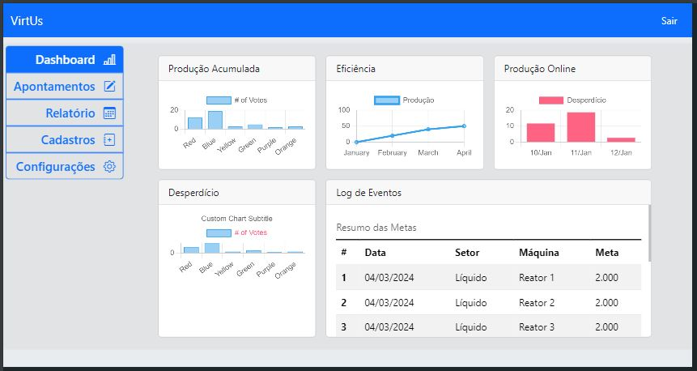
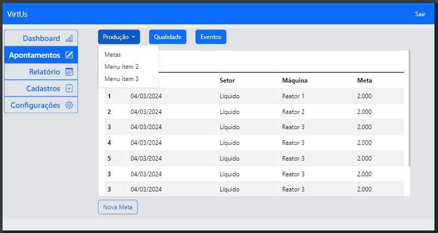
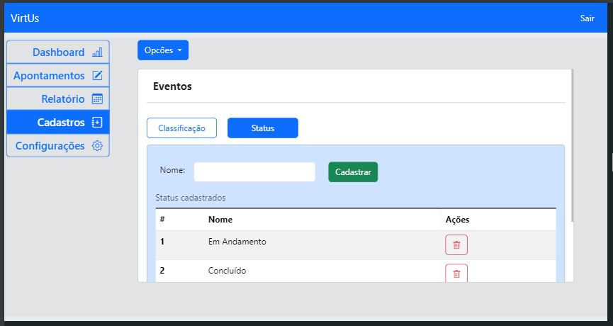

# Telas para Sistema WEB

## Projeto: Gerenciador de produção
Feito com **Html** e com **Bootstrap 5**. 
&nbsp;

As telas demonstram uma ideia de design para os componentes visuais, menu e botões de redirecionamento.

### Algumas imagens
> Dashboard
<h1 align="center">
  
</h1>

> vizualizar e criar metas da produção.

<h1 align="center">
  
</h1>

> Cadastro de novo *Status* para usar no apontamento de *Eventos*

<h1 align="center">
  
</h1>

---
### Seções do projeto
* Dashboard
    > cards de visualização dos graficos e tabelas.
* Apontamentos
    > Visualizar e inserir novos parâmetros.
  * Produção
      > Metas.
  * Qualidade
      > Inspeções.
  * Eventos
      > Alertas.
* Relatórios
    > Gerar relatórios sobre os parâmetros escolhidos.
* Cadastro
    > cadastro e atualização de novos parâmetros.
  * Eventos
  * Máquinas
  * Produtos
  * Qualidade
  * Setor
  * Turno
* Configurações
    > Visualização e configuração dos componentes usados no sistema.

